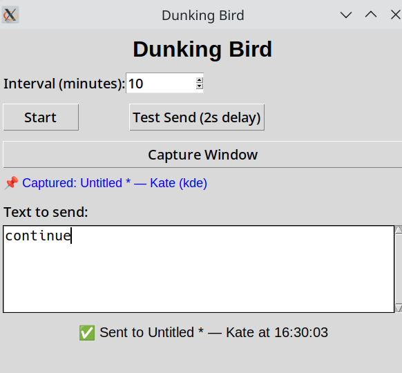

# Dunking Bird


A robust automation tool that sends text to windows at regular intervals. Perfect for keeping coding agents engaged with prompts like "continue" or "keep going". Now with window targeting and bulletproof installation!

## 🖼️ Screenshot



*The app successfully capturing and focusing the "Untitled * — Kate" window with real-time window detection and precise targeting!*

## ✨ Features

- **🎯 Window Capture**: Capture and target specific windows instead of just the active window
- **⚙️ Simple GUI**: Easy-to-use interface with start/stop controls
- **⏱️ Configurable Interval**: Set custom time intervals (0.5-120 minutes)
- **📝 Custom Text**: Send any text you want to the targeted window
- **🔄 Automatic Enter**: Automatically presses Enter after sending text
- **⏰ Real-time Countdown**: Shows when the next text will be sent
- **🖥️ Background Operation**: Runs in the background while you work
- **🔧 Auto-Setup Verification**: Automatically checks and fixes common configuration issues
- **🌐 Wayland & X11 Compatible**: Works on modern Wayland and legacy X11 desktop environments

## 🚀 Installation

### Method 1: Automated Installer (Recommended)

**Super Simple - One Command:**
```bash
curl -fsSL https://raw.githubusercontent.com/user/repo/main/install.sh | bash
```

**With Virtual Environment:**
```bash
curl -fsSL https://raw.githubusercontent.com/user/repo/main/install.sh | bash -s -- --venv
```

The installer automatically:
- ✅ Installs all system dependencies
- ✅ Sets up Python environment (optional venv)
- ✅ Configures ydotool daemon and permissions
- ✅ Installs Wayland capture backend (`kdotool`) when available
- ✅ Tests functionality and provides fixes
- ✅ Creates convenient launcher script

### Method 2: Manual Installation

1. **Clone or download the repository:**
   ```bash
   git clone https://github.com/user/repo.git
   cd dunkingbird
   ```

2. **Run the install script:**
   ```bash
   chmod +x install.sh
   ./install.sh
   ```

3. **Or install manually:**
   ```bash
   sudo apt update
   sudo apt install -y python3-tk ydotool ydotoold kdotool xclip xdotool python3-venv
   pip3 install --user pynput
   sudo ydotoold &
   ```

### Method 3: Quick Test (One-liner)
```bash
sudo apt update && sudo apt install -y python3-tk ydotool xclip && sudo ydotoold & sleep 2 && python3 dunking_bird.py
```

### 🖥️ Desktop Environment Support

**Wayland (Modern):**
- ✅ GNOME Shell
- ✅ KDE Plasma
- ✅ Sway
- ✅ Hyprland
- ✅ Other wlroots compositors

**X11 (Legacy):**
- ✅ GNOME (X11 mode)
- ✅ KDE (X11 mode)
- ✅ i3 / i3-gaps
- ✅ XFCE
- ✅ Any X11 window manager

## 🎯 Usage

### Basic Usage

1. **Launch the application**:
   ```bash
   ./run_dunking_bird.sh    # If using installer
   # OR
   python3 dunking_bird.py   # Direct launch
   ```

2. **Configure your settings**:
   - Set the **interval** in minutes (0.5-120 minutes, default: 10)
   - Enter the **text** you want to send (default: "continue")

3. **Target a specific window (NEW!)**:
   - Click **"Capture Window"** button
   - The currently active window will be captured and targeted
   - See captured window info displayed in blue text
   - All future text will go to this specific window

4. **Test your setup**:
   - Click **"Test Send"** to immediately send text with 2-second countdown
   - Verify the text reaches your target window

5. **Start automation**:
   - Click **"Start"** to begin automatic sending
   - Real-time countdown shows time until next send
   - Click **"Stop"** to pause

### 🎯 Window Targeting Modes

**Mode 1: Active Window (Default)**
- Text sent to whatever window is currently active
- Traditional behavior, good for simple use cases

**Mode 2: Captured Window (NEW!)**
- Click "Capture Window" to lock onto a specific window
- Text always sent to that window, even if it's not active
- Perfect for targeting specific terminals, coding agents, etc.

## 💡 Use Cases

- **🤖 Coding Agents**: Keep AI assistants engaged ("continue", "keep going", "proceed")
- **💻 Terminal Sessions**: Send commands to specific terminals automatically
- **📱 Chat Applications**: Send regular messages to specific chat windows
- **🎮 Gaming**: Send periodic inputs to game windows
- **🔧 Development**: Keep development servers or tools active

## 🚀 Example Workflows

### Workflow 1: Coding Agent Assistant
1. Start your AI coding assistant (Claude, ChatGPT, etc.)
2. Launch Dunking Bird
3. Click "Capture Window" while the AI chat is active
4. Set interval to 15 minutes, text to "continue with the implementation"
5. Click Start - now your AI stays engaged automatically!

### Workflow 2: Terminal Keep-Alive
1. Open your terminal or SSH session
2. Run Dunking Bird
3. Capture the terminal window
4. Set a short interval (1 minute) with a harmless command like "echo 'alive'"
5. Keep your session from timing out

### Workflow 3: Development Server
1. Start your development server in a terminal
2. Capture that terminal window
3. Send periodic commands to check status or restart services

## 🔧 Troubleshooting

### Automatic Fixes
Dunking Bird automatically detects and offers to fix common issues:
- **Setup Issues**: Missing dependencies, daemon not running
- **Permission Problems**: Socket permissions, user group membership
- **Configuration**: Auto-starts ydotool daemon, fixes permissions

### Manual Troubleshooting

**❌ "ydotool: No such device"**
```bash
sudo ydotoold &
sleep 2
# Try running the app again
```

**❌ "Permission denied" on socket**
```bash
sudo chmod 666 /tmp/.ydotool_socket
# OR add user to input group:
sudo usermod -a -G input $USER
# (logout/login required)
```

**❌ "ModuleNotFoundError: tkinter"**
```bash
sudo apt install python3-tk
```

**❌ Window capture not working**
- **KDE Wayland**: Install `sudo apt install kdotool`
- **X11**: Install `sudo apt install xdotool`
- **Wayland/Sway**: Ensure `swaymsg` is available
- **GNOME or generic Wayland**: This app cannot reliably capture and refocus another window without a compositor-specific backend

**Important**: `ydotoold` socket permissions affect typing, not window capture. If capture fails on Wayland, the usual cause is a missing capture backend such as `kdotool`, not the background service.

**❌ Text not reaching target**
- Ensure target window can accept keyboard input
- Try "Test Send" button to verify functionality
- Check that captured window still exists
- Re-capture window if target application was restarted

**❌ Installation issues**
```bash
# Clean install using the automated script
curl -fsSL https://raw.githubusercontent.com/user/repo/main/install.sh | bash
```

### Getting Help
- Run `./install.sh` for automatic dependency checking
- Check installation log: `cat install.log`
- Verify ydotool: `ydotool type "test"`

## 📋 System Requirements

### Minimum Requirements
- **OS**: Ubuntu 20.04+ / Debian 10+ / other apt-based distros
- **Python**: 3.6+ (usually pre-installed)
- **Memory**: 50MB RAM
- **Desktop**: Any X11 or Wayland environment

### Dependencies (Auto-installed)
- `python3-tk` - GUI framework
- `ydotool` - Modern input automation (Wayland compatible)
- `kdotool` - KDE Wayland window discovery/focus
- `xclip` - Clipboard operations (fallback)
- `xdotool` - X11 window management (optional)
- `pynput` - Python input library (fallback)

## 🎉 Success Stories

*"Keeps my Claude coding sessions active for hours! Game changer for long development projects."*

*"Perfect for maintaining SSH connections and development servers. Set it and forget it."*

*"Works flawlessly on both my Wayland laptop and X11 desktop. Installation was super smooth."*

---

**Ready to keep your systems engaged? Install now with one command! 🚀**
